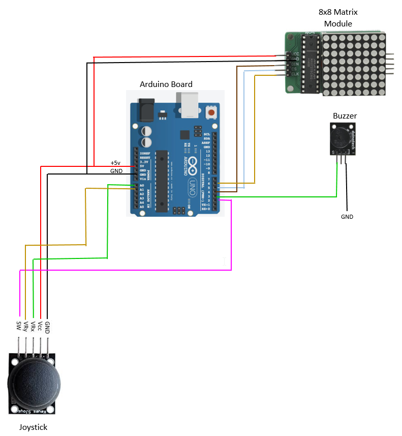
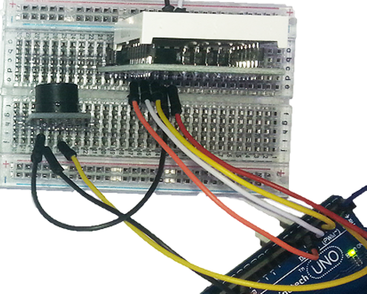

# Snake Game
_Project 00007_

Here's the first of our mini projects that you can build from parts in the XC3900 kit. It's a take on the old 'Snake' game that you might have seen on old Nokia phones or even earlier on Atari. There's nothing difficult about this project, but we'd recommend that you've built a few of the designs from the book before attempting it.

## Bill of Materials
| Qty | Code | Description |
| --- | --- | ---|
|1 | [XC3900](http://jaycar.com.au/p/XC3900) | All in one arduino learning kit

## Connection Table

| UNO | Matrix | Buzzer | Joystick |
|---|--- |--- |--- |
| D2 |  | | SW |
| D3 | | S | |
| D4 | DIN | | |
| D5 | CS | | |
| D6 | CLK ||  |
| A0 | | | VRx |
| A1 | | | VRy |
| 5V | VCC | | +5V |
|GND |GND |- | GND|

### Connection Diagram

## Software Libraries
|Library | Author
| --- |--- |

## Assembly
We started with the matrix by plugging it into row 'B' of the breadboard, so that we can run jumper wires to the front and back of it, then insert the buzzer module to the right- row F works well. The five jumper wires from the matrix to the Uno can be placed next- note that the wires to D4/D5/D6 should all run neatly in parallel. We've run the black GND wire to the – on the buzzer, then from there back to GND on the Uno. Run a jumper wire from S on the buzzer to D3.

To give the joystick a bit of flexibility, plug a group of five female-female jumpers into the headers on the joystick module, then extend them with five male-male jumpers. The joystick connections for D2, A0 and A1 can go directly to the Uno, while the GND and +5V connections can plug in just in front of the matrix module.

Here are the breadboard connections:

## Programming
Download the source code and extract into a new folder, open the .ino file in the Arduino IDE and press upload.

## Use
should be greeted by a 'Press to start' message on the display. Clicking down on the joystick should cause the game to start, and the snake can be steered by using the joystick. During the game, a tone is generated in time with the movement. The game ends when the snake crashes into a wall or itself, and the score is displayed, after which the joystick can be clicked to take us back to the welcome message.

If you are finding some part of the game doesn't work, check the wiring for that part- eg no sound means to check that the buzzer module is wired correctly back to D3 and GND. If the joystick seems to be moving in the wrong direction, you might have some wires swapped between the joystick module and Uno.

## Future Improvements
